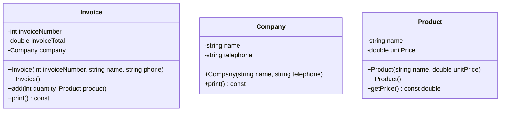

```mermaid


classDiagram


    class Invoice {


        -int invoiceNumber


        -double invoiceTotal


        -Company company


        +Invoice(int invoiceNumber, string name, string phone)


        +~Invoice()


        +add(int quantity, Product product)


        +print() const


    }


 


    class Company {


        -string name


        -string telephone


        +Company(string name, string telephone)


        +print() const


    }


 


    class Product {


        -string name


        -double unitPrice


        +Product(string name, double unitPrice)


        +~Product()


        +getPrice() const double


    }

```

